# Ubuntu minimal installation

## Boot on ISO

## Ubuntu live startup
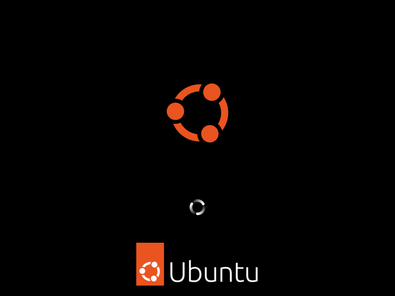

## Install Ubuntu
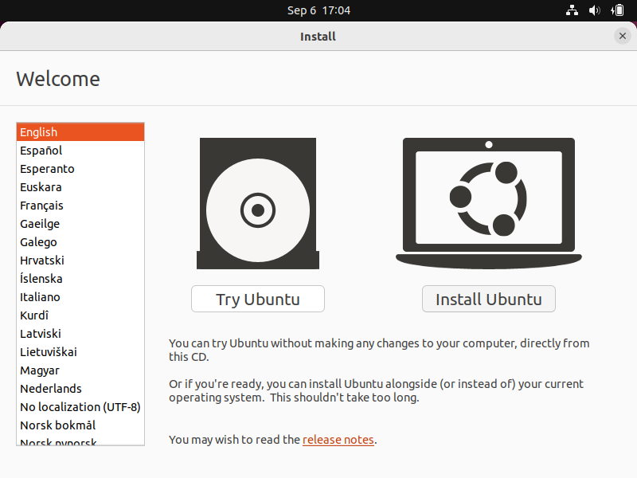

## Keyboard setup
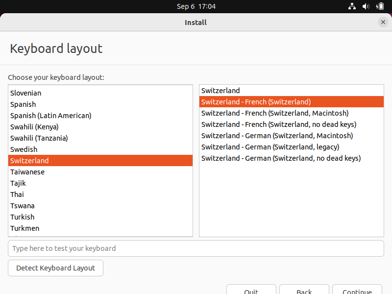

## Minimal install
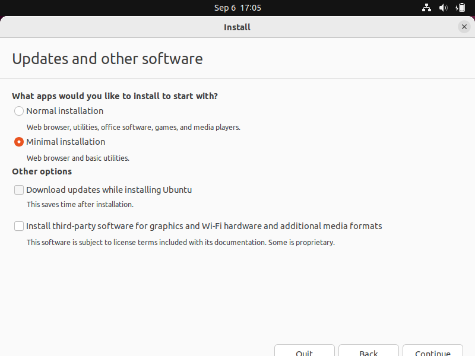

## Installation type (LVM without encryption)
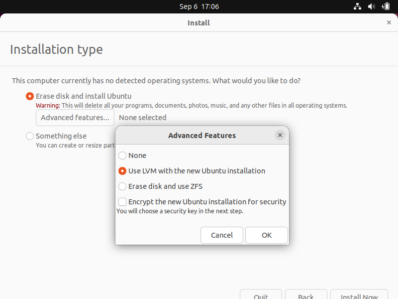

## Installation type (Erase and install)
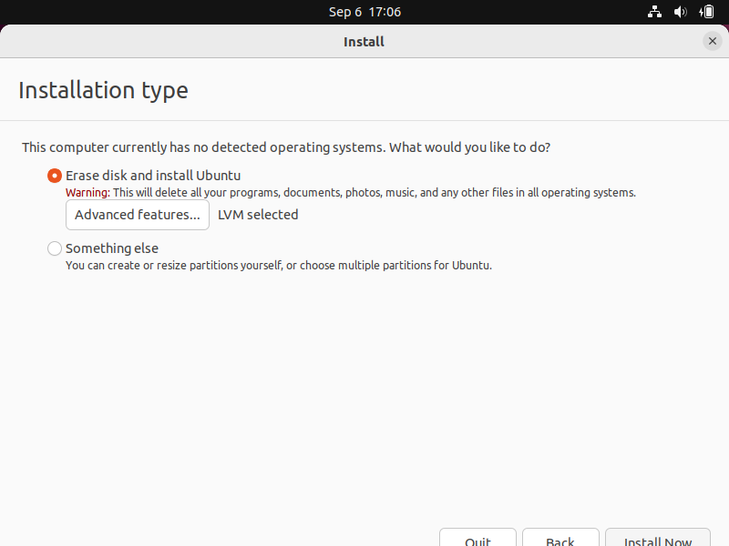

## Installation type (Write the changes)
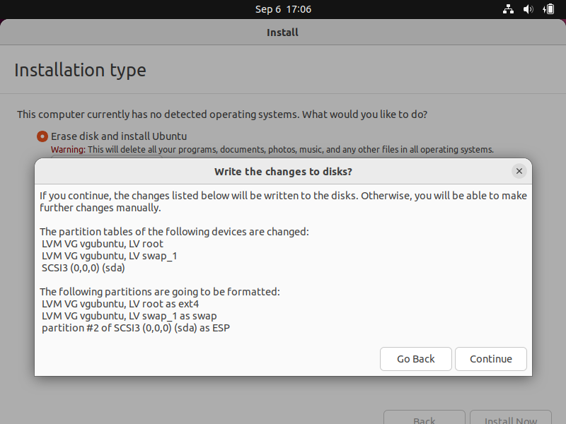

## Location
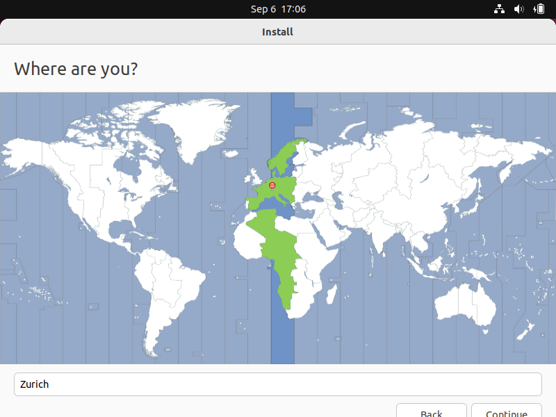

## Administator user setup
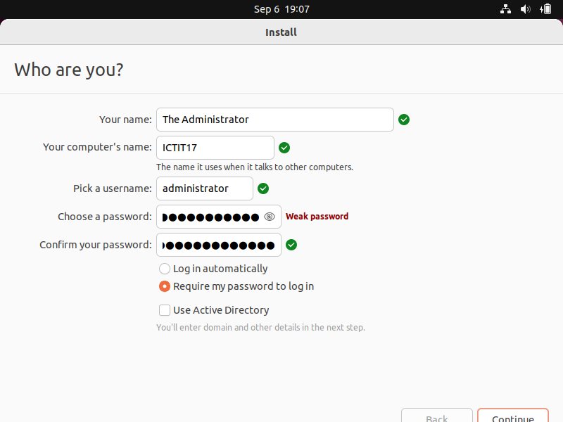

## Install ⏳
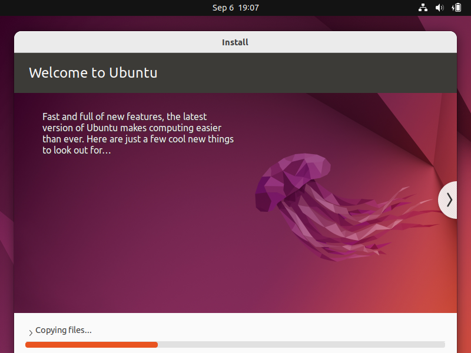

## Restart now
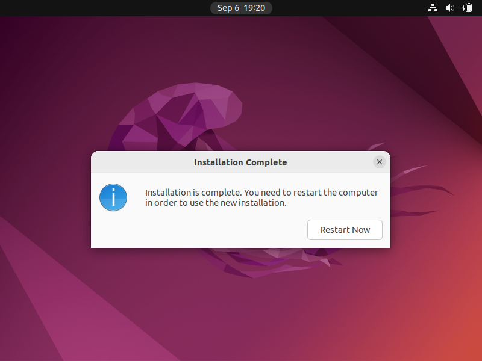

## Remove installation medium (nothing to do)
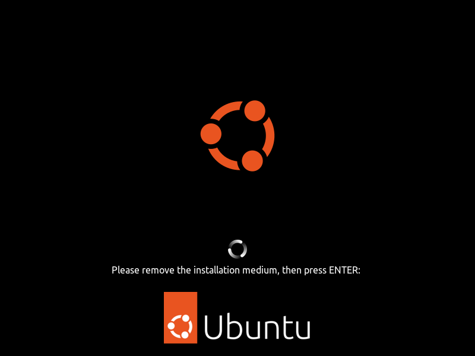

## Reboot
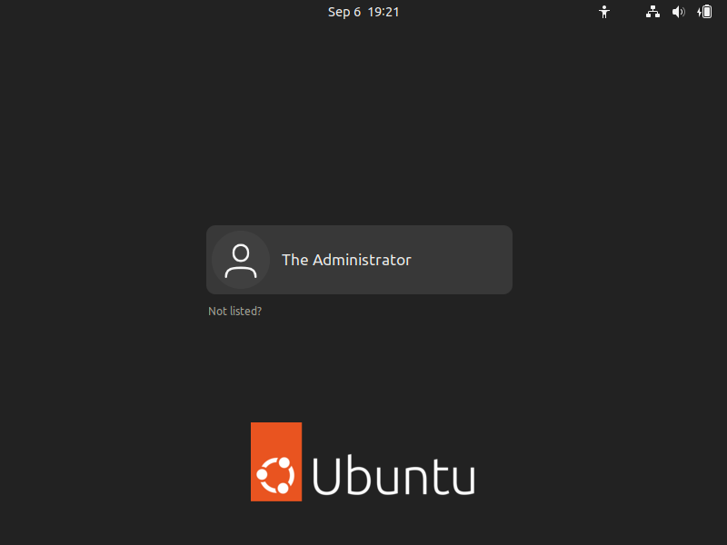

## Say no to reporting

## and to location services
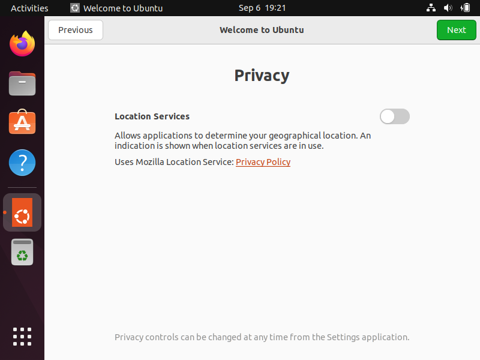

## Open terminal and install indispensables
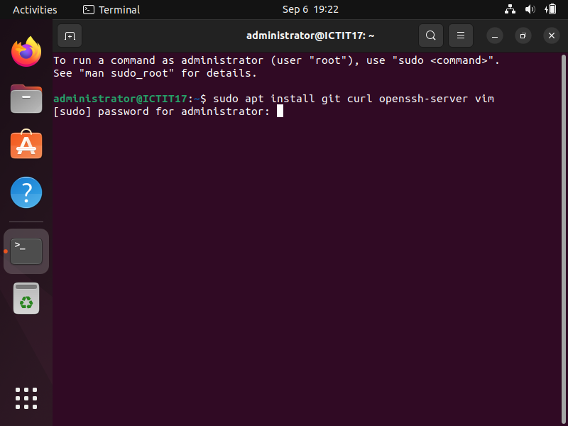
